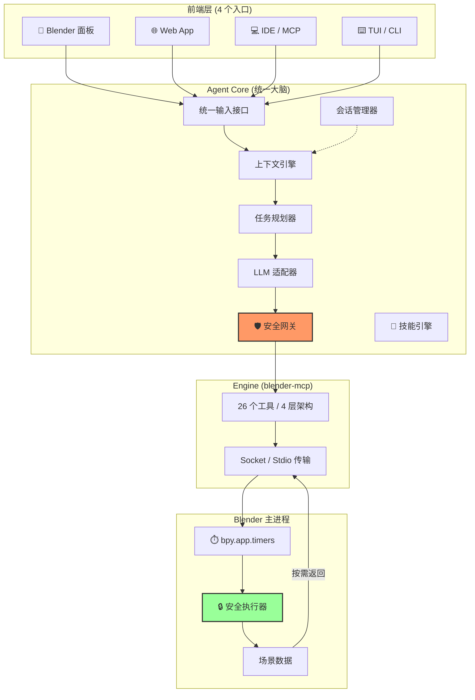

# BlenderAgentBot 完整架构与生态设计文档 (v4.0)

 **版本** : v4.0 (Ecosystem Edition)
 **日期** : 2026-03-05
 **状态** : **全生态架构规划** — 从单一 MCP 工具进化为多前端 AI 平台
 **前置成果** : [blender-mcp](https://github.com/ageless-h/blender-mcp) 已验证核心引擎可行性（4 层架构，26 工具，18+ MCP 客户端，PyPI 发布）

---

## 1. 执行摘要

blender-mcp 作为练手项目已超越 MVP，证明了 MCP 协议驱动 Blender 自动化的技术可行性。但当前的产品形态（需外部 MCP 客户端 + 手动配置）仅覆盖开发者群体，对艺术家和普通用户几乎不可用。

**BlenderAgentBot 的目标**：在 blender-mcp 引擎之上，构建完整的多前端生态，让 **所有用户** 都能通过 AI 驱动 Blender。

 **核心原则** :

* **安全第一** : 进程隔离 + 主线程执行 + 分级安全体系，确保 Blender 主进程绝对稳定
* **版本务实** : 最低支持 **Blender 4.2 LTS**，推荐 4.5 LTS+，覆盖最广泛的用户群
* **引擎与前端分离** : blender-mcp 是"手臂"，Agent Core 是"大脑"，前端是"嘴巴和眼睛"
* **模型自由** : 不绑定任何 LLM 供应商，云端/本地/私有部署全支持
* **渐进复杂** : 简单事情简单做，复杂事情有路可走

---

## 2. 系统总体架构：三层分离

### 2.1 架构概览

```
                         ┌─── Blender 面板 UI（艺术家）
                         │
                         ├─── Web App（远程/协作/展示）
  用户 ──→  前端层 ──→   │
                         ├─── IDE / MCP 客户端（开发者/TA）
                         │
                         └─── TUI / CLI（极客/Pipeline）
                              │
                     ┌────────▼─────────┐
                     │   Agent Core     │  ← 统一的 AI 大脑
                     │  ╔═════════════╗ │
                     │  ║ LLM 适配器  ║ │
                     │  ║ 任务规划器  ║ │
                     │  ║ 安全网关    ║ │
                     │  ║ 会话管理    ║ │
                     │  ║ 上下文引擎  ║ │
                     │  ╚═════════════╝ │
                     └────────┬─────────┘
                              │ 统一的 Tool Protocol
                     ┌────────▼─────────┐
                     │   blender-mcp    │  ← 已验证的核心引擎
                     │  (26 tools,      │
                     │   4 layers)      │
                     └────────┬─────────┘
                              │ Socket / Stdio
                     ┌────────▼─────────┐
                     │    Blender       │
                     └──────────────────┘
```

### 2.2 三层职责

| 层 | 职责 | 状态 |
|:---|:---|:---:|
| **Engine (blender-mcp)** | 26 个工具 + Blender Addon + 通信传输 | ✅ 已完成 |
| **Agent Core** | LLM 适配 + 任务规划 + 安全网关 + 上下文引擎 + 会话管理 + 技能引擎 | 🆕 新建 |
| **Frontend** | Blender 面板 / Web / IDE-MCP / TUI-CLI | 🆕 新建 |

### 2.3 数据流图



---

## 3. Engine 层：blender-mcp（已完成）

### 3.1 四层工具架构

| 层 | 工具数 | 职责 | 示例 |
|:---|:---:|:---|:---|
| **感知层** | 11 | 只读查询场景状态 | `get_objects`, `get_node_tree`, `capture_viewport` |
| **声明式写入层** | 3 | 结构化编辑（节点/动画/序列） | `edit_nodes`, `edit_animation`, `edit_sequencer` |
| **命令式写入层** | 9 | 高级对象操作 | `create_object`, `modify_object`, `manage_material` |
| **后备层** | 3 | 自由代码执行 + 导入导出 | `execute_script`, `execute_operator`, `import_export` |

### 3.2 通信机制

Blender Python API (`bpy`) 非线程安全。所有操作 **仅在主线程** 通过 `bpy.app.timers` 轮询执行（每 0.1s），杜绝后台线程访问 `bpy` 的风险。

### 3.3 重构方向

| 当前 | 目标 |
|:---|:---|
| Engine + MCP Frontend 混合 | 抽取为独立 `blender-engine` 包，与上层完全解耦 |
| 仅 Socket 通信 | 增加 stdin/stdout 传输模式（适配子进程启动） |
| 单会话 | 支持多会话并发（Web 多用户场景） |

---

## 4. Agent Core：统一的 AI 大脑（新建）

所有前端共享同一套 Agent 逻辑，避免重复实现和行为不一致。

### 4.1 核心模块

| 模块 | 职责 |
|:---|:---|
| **LLM 适配器** | 统一不同 LLM 的调用接口，支持流式输出和 tool_use |
| **任务规划器** | 将模糊指令拆解为工具调用序列："建个小屋" → [create × N, material × N...] |
| **安全网关** | AST 黑名单 + 操作危险等级标记 + 用户确认流程 |
| **上下文引擎** | 操作前自动拉取场景数据，操作后截图回传给 LLM |
| **会话管理器** | 多用户/多会话隔离，对话历史维护 |
| **工具路由器** | Agent 决策 → blender-mcp 调用映射、重试、错误恢复 |
| **🧬 技能引擎** | 技能匹配 + 执行 + 录制 + 进化（详见 4.3 节） |

### 4.2 多协议暴露

Agent Core 通过多协议同时服务不同前端：

```
Agent Core
  ├── HTTP REST API   → Web Frontend
  ├── WebSocket       → Web (实时流)
  ├── Stdin/Stdout    → Blender 子进程 / CLI
  ├── MCP Protocol    → IDE 客户端
  └── gRPC (可选)     → Pipeline 集成
```

### 4.3 技能进化系统（借鉴 EvoMap GEP 协议）

核心思想来自 EvoMap.ai 的 Genome Evolution Protocol：AI 解决问题的经验不应一次性丢弃，而应封装为可复用、可共享、可进化的 **Skill Capsule**。

**Skill Capsule 格式**：

```yaml
# skills/builtin/low_poly_table.yaml
metadata:
  name: "low_poly_table"
  tags: ["furniture", "low-poly"]
  success_rate: 0.94
  usage_count: 1283

gene:  # 核心策略（给 LLM 理解）
  strategy: |
    1. 创建扁平立方体作为桌面
    2. 在四角创建桌腿
    3. 添加统一材质
  parameters:
    table_width: { default: 1.5, range: [0.5, 3.0] }
    table_height: { default: 0.75, range: [0.5, 1.5] }

capsule:  # 可执行的工具调用序列
  steps:
    - tool: blender_create_object
      args: { name: "TableTop", object_type: "MESH", primitive: "cube" }
    - tool: blender_modify_object
      args: { name: "TableTop", scale: ["$table_width", 1.0, 0.05] }
    # ...

validation:  # 执行后验证
  - object_exists: ["TableTop", "Leg_FL", "Leg_FR", "Leg_BL", "Leg_BR"]
  - object_count_gte: 5
```

**任务规划器的变化**（Skill 优先 + LLM 兜底）：

```
用户请求 "建个桌子"
  → 1. 技能库匹配 → 有 low_poly_table (成功率 94%) → 直接用
  → 2. 无匹配 → LLM 从零生成 → 自动录制为新 Skill
  → 3. 执行 → 验证 → 更新成功率
  → 4. 用户满意? → 👍 成功率 +1 / 👎 触发优化
```

**技能引擎子模块**：

| 子模块 | 职责 |
|:---|:---|
| SkillStore | 本地技能库存储（YAML 文件） |
| SkillMatcher | 模糊匹配用户意图 → 已有技能 |
| SkillExecutor | 执行 Capsule 的工具调用序列 |
| SkillRecorder | 将 LLM 新生成的操作自动录制为 Skill |
| SkillEvolver | 根据执行结果和用户反馈优化 Skill |
| SkillMarketplace | 社区技能包的发布/下载 |
| **UndoAwareTracker** | **监听撤销事件，将 undo 作为隐式负反馈驱动进化** |

**Undo 驱动的 Skill 进化**：

撤销是最诚实的用户反馈 — 用户按 Ctrl+Z 不会撒谎。因为每个 Skill 执行被包装为自定义 Operator（`bl_options={'UNDO'}`），我们可以精确监听某个 Skill 是否被撤销。

```
Skill 执行完成 → 用户 Ctrl+Z 撤销
  → 1. 记录负反馈：该 Skill 的 undo_rate 上升
  → 2. 捕获修正：监听用户 undo 后的手动操作（= 进化方向）
  → 3. 分步统计：复杂 Skill 中哪一步最常被撤销 → 精准优化
```

Skill Capsule 格式扩展：

```yaml
metadata:
  success_rate: 0.94
  undo_rate: 0.12                # 被撤销的比例
  partial_undo_stats:             # 分步撤销统计
    step_1_structure: 0.02       # 很少被撤销
    step_2_furniture: 0.08       # 偶尔
    step_3_lighting: 0.15        # 经常被撤销 → 触发优化

capsule:
  steps:
    - tool: blender_create_object
      undo_group: "structure"     # 撤销分组 → 一个 Operator
    - tool: blender_create_object
      undo_group: "furniture"     # 不同分组 → 可独立撤销
    - tool: blender_setup_scene
      undo_group: "lighting"
```

> 用户什么都不用做（不用点评分、不用写反馈），仅仅是正常使用 undo/redo，Skill 系统就在静默地学习和进化。

**渐进实施**：
- Phase 1：随插件内置 20+ 手写技能包（零 LLM 成本完成常见操作）
- Phase 2：LLM 新操作自动录制为本地 Skill + undo 监听
- Phase 3：社区发布/安装机制 + undo 驱动的自动进化

---

## 5. 前端层：四个入口

### 5.1 🎨 Blender 内置面板（艺术家的入口）

**目标**：不离开 Blender，纯自然语言交互。

```
┌─ AI Assistant ───────────────┐
│ 🤖 创建了一个 2m 的立方体      │
│ 🤖 已添加金属材质             │
│ [截图预览]                    │
│                              │
│ 👤 把它变成红色的，再加个倒角   │
│                              │
│ ┌──────────────────────────┐ │
│ │ 输入指令...          ↩️   │ │
│ └──────────────────────────┘ │
│ [预览操作] [撤销] [设置]      │
└──────────────────────────────┘
```

| 特性 | 说明 |
|:---|:---|
| 零配置启动 | Addon 内置 Agent Core 子进程，自动启动 |
| 操作预览 | 执行前显示即将执行的操作，用户确认后执行 |
| 视觉反馈 | 每步操作后自动截图回显，AI 和用户都能"看到"结果 |
| 一键撤销 | 每条消息旁有撤销按钮 |
| 场景感知 | 自动识别选中物体，"让它变大" = 对当前选中物体操作 |
| 多模态输入 | 支持拖入参考图（"照这个风格做一把椅子"） |

**技术实现**：Addon (`bpy.types.Panel`) → stdin/stdout → Agent Core 子进程 → Engine → Blender Socket

### 5.2 🌐 Web App（远程/协作的入口）

**目标**：浏览器即可控制 Blender，支持远程和多人。

| 特性 | 说明 |
|:---|:---|
| 实时视口 | WebRTC 视频流 或 定时截图刷新 |
| 无需本地安装 | Blender + Agent 跑在服务器，用户只需浏览器 |
| 分享链接 | 生成临时链接，他人可实时观看 AI 建模过程 |
| 文件导出 | 直接在 Web 端下载 .blend / .fbx / .glb |

**技术实现**：Browser (React/Vue) → WebSocket → FastAPI → Agent Core → Engine → Blender

### 5.3 💻 IDE / MCP 客户端（开发者的入口）

**当前状态**：✅ 已可用，blender-mcp 天然支持 18+ MCP 客户端。

**提升方向**：

| 当前 | 目标 |
|:---|:---|
| 手动配置 MCP JSON | `blender-mcp setup cursor` 一键生成配置 |
| 纯文本交互 | 利用 MCP Resource 回传视口截图 |
| 无 Agent 层 | 可选集成 Agent Core 做二次规划 |

### 5.4 ⌨️ TUI / CLI（极客和 Pipeline 的入口）

```bash
$ blender-agent chat                    # 交互式聊天
$ blender-agent run script.yaml         # 批处理
$ blender-agent setup                   # 一键配置安装
$ blender-agent status                  # 连接状态
$ blender-agent tools blender_get_scene # 直接调用工具
```

**技术实现**：CLI (Typer/Click) → Agent Core → Engine → Blender

---

## 6. 模型支持体系

### 6.1 设计目标

让用户用 **任何他想用的模型** 驱动 Blender — 云端旗舰、本地开源、企业私有部署。

### 6.2 云端模型矩阵

| 模型 | Tool Calling | 视觉 | 上下文 | 推荐定位 |
|:---|:---:|:---:|:---:|:---|
| **Claude Opus 4.6** | ✅ | ✅ | 200K | 旗舰首选 — 长上下文 + 精准 tool use |
| **Claude Sonnet 4.5** | ✅ | ✅ | 200K | 性价比之选 |
| **GPT-5.2** | ✅ | ✅ | 128K | 多轮工具调用精度最高 |
| **Gemini 3.1 Pro** | ✅ | ✅ | 2M | 超大上下文，整场景分析 |
| **Gemini 3.1 Flash** | ✅ | ✅ | 1M | 低延迟低成本 |
| **DeepSeek V3.2** | ✅ | ✅ | 128K | 中国用户首选，性价比极高 |

### 6.3 本地模型矩阵

| 模型 | 参数量 | Tool Calling | 视觉 | 最低 VRAM |
|:---|:---:|:---:|:---:|:---:|
| **Llama 4** | 70B | ✅ | ✅ | 48GB |
| **Llama 4 Scout** | 8B | ✅ | ✅ | 8GB |
| **Qwen3-Coder** | 32B | ✅ | ❌ | 24GB |
| **DeepSeek V3.2 开源** | 67B | ✅ | ✅ | 40GB |
| **Phi-4-mini** | 3.8B | ⚠️ | ❌ | 4GB |

本地运行时：**Ollama**（个人首选）、**vLLM**（团队部署）、**LM Studio**（GUI 用户）、**LocalAI**（Docker 部署）

### 6.4 统一适配器架构

```python
class LLMAdapter(ABC):
    def get_capabilities(self) -> ModelCapabilities: ...
    async def generate(self, messages, tools) -> LLMResponse: ...
    async def stream(self, messages, tools) -> AsyncIterator[StreamChunk]: ...
```

```
LLMAdapter
  ├── OpenAIAdapter     → GPT + Ollama + vLLM + LM Studio + LocalAI (全部 OpenAI 兼容)
  ├── AnthropicAdapter  → Claude 系列
  ├── GoogleAdapter     → Gemini 系列
  └── FallbackAdapter   → 无 tool calling 的模型，用 prompt 模拟
```

> **关键决策**：绝大多数本地运行时提供 OpenAI 兼容 API，只需实现一个 `OpenAIAdapter` 即可覆盖 80% 模型。

### 6.5 能力感知降级

Agent Core 根据 `ModelCapabilities` 自动调整行为：

| 能力 | 有 | 无（降级方案） |
|:---|:---|:---|
| Tool Calling | 原生 tool_use 调用 | Prompt 模拟 + 正则解析 JSON |
| 视觉 | 发送视口截图 | 自动生成文本场景摘要 |
| 并行工具 | 单轮批量调用 | 逐个串行调用 |
| 大上下文 (>100K) | 完整对话历史 | 滑动窗口 + 历史摘要压缩 |

### 6.6 多模态视觉流水线

```
用户指令 → Agent Core
  → 模型支持视觉? 
    → ✅ 调用 capture_viewport → 截图+指令 发给 LLM
    → ❌ 调用 get_objects → 文本摘要+指令 发给 LLM
  → LLM 生成操作 → 执行
  → 支持视觉? → ✅ 再次截图 → LLM 验证结果 (视觉反馈循环)
```

### 6.7 Prompt 工程

System Prompt 三层组合：**Base Layer**（所有模型共享）+ **Model Layer**（模型特化指令）+ **Persona Layer**（角色模板，用户可选）

角色模板：`architect` (建筑可视化)、`character` (角色建模)、`game_assets` (游戏资产)、`beginner` (教学助手)

### 6.8 智能路由与成本控制

| 任务类型 | 路由到 | 成本/千次 |
|:---|:---|:---:|
| 简单查询 | Gemini Flash / 本地 | ~$0.5 / $0 |
| 常规操作 | Claude Sonnet / GPT-5.2 | ~$12-20 |
| 复杂建模 | Claude Opus | ~$45 |
| 需要视觉 | 任意视觉模型 | 视模型而定 |

---

## 7. 安全体系：分级防御

### 7.1 安全等级金字塔

| 等级 | 操作类型 | 处理策略 |
|:---|:---|:---|
| **Level 0** | 只读（get_objects, get_scene, capture_viewport） | 自动放行 |
| **Level 1** | 可逆写操作（create, modify, add_modifier） | 默认执行，可撤销 |
| **Level 2** | 高影响操作（delete_all, 批量操作, 渲染设置） | 需用户确认 |
| **Level 3** | 危险操作（execute_script 自由代码） | 仅显式模式 |
| **禁止** | os.system, subprocess, 网络请求, 文件删除 | 绝对拒绝 |

### 7.2 安全流程

```
生成的代码 → AST 静态分析
  → 含禁止项 → ❌ 拒绝 + 告知用户
  → Level 0-1 → ✅ 自动执行 → 推入撤销栈
  → Level 2   → ⚠️ 请求用户确认 → 确认后执行
  → Level 3   → 🔒 仅限显式授权模式
  → 执行失败  → 自动回滚
```

---

## 8. Blender 宿主进程设计

### 8.1 通信层：基于定时器的非阻塞轮询

Blender 官方文档明确指出 `bpy` 非线程安全。所有外部通信通过 `bpy.app.timers` 回调处理（每 0.1s），完全在主线程中执行。

### 8.2 执行层：动态上下文与沙箱

- **上下文捕获**：动态查找 `VIEW_3D` 区域、窗口、屏幕
- **临时覆盖执行**：4.5+ 使用 `bpy.context.temp_override`；4.2 LTS 需兼容旧版上下文覆盖方式

### 8.3 撤销/重做机制（调研结论）

> **核心问题**：`bpy.app.timers` 回调中执行的代码 **不会自动创建任何撤销步骤**。直接修改 `bpy.data` 属性也不会。这导致用户无法 Ctrl+Z 撤销 AI 操作。

**操作类型与撤销行为**：

| 操作方式 | 自动创建撤销步骤 | 说明 |
|:---|:---:|:---|
| 手动 UI 操作 | ✅ | 用户正常操作，每步可撤销 |
| `bpy.ops.xxx()` | ✅ | 但每个 ops 是独立步骤（过于细碎） |
| 直接修改 `bpy.data` | ❌ | 完全不产生撤销记录 |
| `bpy.app.timers` 回调 | ❌ | BlenderAgentBot 的核心场景 |
| 自定义 Operator (`bl_options={'UNDO'}`) | ✅ | **整个 Operator 为一步** |

**解决方案：自定义 Operator 包装**

将每次 AI 操作包装为自定义 Operator，利用 Blender 原生 undo 机制：

```python
class BLENDERAGENT_OT_execute(bpy.types.Operator):
    bl_idname = "blenderagent.execute"
    bl_label = "BlenderAgent Execute"
    bl_options = {'REGISTER', 'UNDO'}  # 整个 Operator = 一个撤销步骤

    code: bpy.props.StringProperty()

    def execute(self, context):
        exec(self.code, {"bpy": bpy, "mathutils": mathutils}, {})
        return {'FINISHED'}   # 自动创建一个完整撤销步骤
        # 失败时 return {'CANCELLED'} → 不污染撤销栈
```

**关键设计规则**：

| 规则 | 原因 |
|:---|:---|
| 用名称（str）引用对象，不缓存 bpy 引用 | undo 后所有 Python 引用失效（`ReferenceError`） |
| 包装为自定义 Operator + `bl_options={'UNDO'}` | 用户按一次 Ctrl+Z 撤销整个 AI 操作 |
| `CANCELLED` 返回时不创建撤销步骤 | 失败操作不污染撤销栈 |
| 不在 exec 内部调用 `bpy.ops.ed.undo()` | 会撤销脚本之前的状态（不可控） |
| undo 后立即清除所有缓存引用 | 防止访问已释放内存 |

### 8.4 状态同步：按需拉取

- **静默默认**：用户操作场景时，Blender 不主动发送任何数据
- **显式请求**：AI 代理需要时主动请求（如 `get_object_info`）
- **快速响应**：主线程中快速查询，返回精简 JSON

---

## 9. 版本兼容性

| 版本 | 状态 | 说明 |
|:---|:---:|:---|
| **Blender 4.2 LTS** | 最低要求 | 支持至 2026 年 7 月，需兼容旧版上下文 API |
| **Blender 4.5 LTS** | 推荐 | 支持至 2027 年 7 月，`temp_override` 稳定 |
| **Blender 5.0 / 5.1** | 推荐 | 最新几何节点和渲染优化 |
| **Blender 5.2** | 预留 | 预计 2026 年中发布，架构预留接口 |
| **4.1 及更早** | 不支持 | 放弃旧版本维护 |

---

## 10. 项目结构

```
BlenderAgentBot/
├── packages/
│   ├── engine/                    # blender-mcp 重构后的核心引擎
│   │   ├── tools/                 # 26 个工具定义
│   │   ├── transport/             # Socket / Stdio 传输层
│   │   └── addon/                 # Blender 插件
│   │
│   ├── agent-core/                # AI 大脑
│   │   ├── llm/                   # LLM 适配器
│   │   ├── planner/               # 任务规划
│   │   ├── safety/                # 安全网关
│   │   ├── context/               # 上下文引擎
│   │   ├── session/               # 会话管理
│   │   └── skills/                # 🧬 技能引擎
│   │
│   ├── frontend-blender/          # Blender 内置面板 UI
│   ├── frontend-web/              # Web 应用
│   ├── frontend-cli/              # TUI / CLI
│   └── frontend-mcp/              # MCP 协议前端
│
├── shared/
│   ├── protocol/                  # 统一消息格式
│   ├── config/                    # 共享配置 schema
│   └── types/                     # 共享类型定义
│
├── skills/
│   ├── builtin/                   # 🧬 内置技能包 (20+)
│   └── community/                 # 社区下载的技能包
│
├── examples/
│   ├── prompts/                   # System Prompt 模板
│   ├── recipes/                   # 实战食谱
│   └── pipelines/                 # 批处理 YAML 示例
│
└── pyproject.toml
```

---

## 11. 风险评估

| 风险点 | 可能性 | 影响 | 缓解措施 | 状态 |
|:---|:---:|:---:|:---|:---:|
| Blender 崩溃 | 低 | 灾难性 | 进程隔离 + 主线程执行 + 无后台线程 | ✅ 已规避 |
| UI 卡顿 | 中 | 高 | 非阻塞轮询 + 按需同步 + 限制执行时间 | 待实测 |
| 恶意代码执行 | 中 | 高 | AST 分析 + 分级安全 + 沙箱 + 自动撤销 | 部分实施 |
| 版本不兼容 | 低 | 中 | 锁定 4.5+ + 启动检测 | ✅ 已实施 |
| 模型幻觉 | 高 | 中 | 操作预览确认 + 小步执行 + 视觉验证循环 | 待实施 |
| 多前端行为不一致 | 中 | 中 | 统一 Agent Core，所有前端共享同一大脑 | 架构保证 |

---

## 12. 开发路线图

### Phase 0：重构基础（2-3 周）

> 将 blender-mcp 拆分为 engine + mcp-frontend，不改变外部行为

* [ ] 从 blender-mcp 中抽取 engine 层为独立包
* [ ] 定义统一的 `AgentRequest / AgentResponse` 消息协议
* [ ] 确保重构后 MCP 模式完全兼容
* [ ] **里程碑** : 所有现有 MCP 测试通过，`uvx ageless-blender-mcp` 继续可用

### Phase 1：Agent Core + Blender UI（4-6 周）

> 构建 AI 大脑，让艺术家在 Blender 里直接聊天

* [ ] 实现 Agent Core（LLM 适配器 + 任务规划 + 安全网关）
* [ ] 实现 `OpenAIAdapter`（覆盖 GPT + Ollama + vLLM + LM Studio）
* [ ] 实现 `AnthropicAdapter`（Claude 原生 tool_use）
* [ ] 开发 Blender 侧边栏聊天面板
* [ ] 实现视口截图自动回传 + 视觉验证循环
* [ ] 实现分级安全体系
* [ ] 实现技能引擎基础（SkillStore + SkillMatcher + SkillExecutor）
* [ ] 编写 20+ 内置技能包（常见建模/材质/灯光操作）
* [ ] **里程碑** : 用户在 Blender 内用自然语言完成"创建一个带材质的小屋"全流程

### Phase 2：CLI + Web（4-6 周）

> 扩展到终端和浏览器

* [ ] 实现 CLI 交互式聊天 + 批处理模式
* [ ] 实现 `blender-agent setup` 一键配置
* [ ] 开发 Web 前端（聊天 + 视口预览）
* [ ] 实现 WebSocket 实时通信
* [ ] 增加 Google Gemini + DeepSeek 适配器
* [ ] **里程碑** : 通过浏览器远程控制本地 Blender

### Phase 3：打磨与生态（4-6 周）

> 能力降级、成本优化、内容建设

* [ ] 实现无 tool-calling 模型的 Prompt 降级方案
* [ ] 实现智能路由 + 成本控制
* [ ] 实现基准测试自动化 + 模型评分卡
* [ ] 实现 SkillRecorder（LLM 操作自动录制为 Skill）
* [ ] 实现 SkillMarketplace（社区技能包发布/下载）
* [ ] 实现 SkillEvolver（成功率驱动的自动优化）
* [ ] 发布 20+ Cookbook 实战用例
* [ ] 发布 System Prompt 模板市场
* [ ] **里程碑** : 完整的生态体系 + 技能进化系统，发布正式版

### Phase 4：真实测试（3-4 周）

* [ ] 性能测试：1k, 10k, 100k 物体场景下帧率和延迟
* [ ] 压力测试：连续 1000 次高频指令
* [ ] 兼容性测试：Blender 4.5 LTS, 5.0, 5.1
* [ ] 安全审计：恶意代码注入测试
* [ ] 多模型对比测试：生成模型评分卡
* [ ] **里程碑** : 真实测试报告，修复 Bug，发布稳定版

---

## 13. 结语

BlenderAgentBot 的愿景是从一个 MCP 工具进化为一个完整的 AI 平台：

* **短期** : 引擎稳固（已完成），Agent Core 上线，Blender 内置 UI 可用
* **中期** : 多前端全通，模型自由切换，安全体系完备
* **长期** : 成为 Blender + AI 领域的基础设施标准

**北极星指标**：
* GitHub Stars > 100 → 1000+
* 月活安装 > 50 → 500+
* Blender 社区自发讨论 → 官方推荐

**底线承诺**：无论功能如何扩展，**不会让用户丢失工作成果、不会让 Blender 意外关闭**。

---

**附录：关键参考信息 (截至 2026-03-05)**

* **blender-mcp 仓库** : [https://github.com/ageless-h/blender-mcp](https://github.com/ageless-h/blender-mcp)
* **Blender 下载与版本** : [https://www.blender.org/download/](https://www.blender.org/download/)
* **Blender 4.5 LTS 支持周期** : 至 2027 年 7 月
* **Blender Python API 线程安全警告** : [https://docs.blender.org/api/current/info_tips_and_gotchas.html#multi-threading](https://docs.blender.org/api/current/info_tips_and_gotchas.html#multi-threading)
* **Model Context Protocol (MCP)** : [https://modelcontextprotocol.io/](https://modelcontextprotocol.io/)
